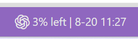

# Agent Center

语言：<a href="https://github.com/mapengsen/Agent-Center/tree/main">English（默认）</a> | <a href="https://github.com/mapengsen/Agent-Center/blob/main/README.zh-CN.md">简体中文</a>

Agent Center 用于将 AI 编码 Agent 的信息与实用功能集中到 VS Code 中。当前版本在状态栏显示 Codex 和 Claude 的使用额度。

**GitHub**: [github.com/mapengsen/Agent-Center](https://github.com/mapengsen/Agent-Center)

**Plugin**: [marketplace.visualstudio.com/items?itemName=pengsen.codex-claude-agent-status](https://marketplace.visualstudio.com/items?itemName=pengsen.codex-claude-agent-status)

**我的所有插件推荐：**

1. **Notifyer Plugin**: [marketplace.visualstudio.com/items?itemName=pengsen.codex-task-companion](https://marketplace.visualstudio.com/items?itemName=pengsen.codex-task-companion)
2. **Agent Center**：[marketplace.visualstudio.com/items?itemName=pengsen.codex-claude-agent-status](https://marketplace.visualstudio.com/items?itemName=pengsen.codex-claude-agent-status)

## 主要功能

- 使用 `5% left | 8-20 11:24` 或 `5% used | 8-20 11:24` 这样的紧凑单行格式。
- 显示 Codex 短窗口、长窗口、账户邮箱和套餐信息。
- 显示 Claude 5 小时、7 天、Opus 与 Sonnet 窗口信息。
- 鼠标悬停信息使用按类别区分的彩色 Emoji 标记状态栏含义、账户、套餐、额度窗口、重置时间、最后更新时间和操作入口；百分比标记会随着已使用比例升高依次变为绿、黄、橙、红。（状态栏重置时间使用 Agent Center 运行环境的时区；如果远程服务器和 Windows 时区不同，显示的时钟时间也可能不同。）
- 支持剩余/已使用两种显示模式，并可点击状态栏立即刷新。
- 只有手动请求期间显示旋转的“刷新中”动画；自动刷新时保持正常状态显示。
- 启动时立即刷新，随后每 60 秒自动刷新一次，共 3 次；之后使用默认 15 分钟的常规间隔。常规阶段刷新失败时每 30 秒重试，单轮最多尝试 5 次。

## 更新日志

### 0.1.3 - 2026-08-24

- 将悬浮提示中的单色 Codicon 替换为一套独立的彩色 Emoji。
- 根据已使用额度增加绿、黄、橙、红动态百分比标记。

### 0.1.2 - 2026-08-24

- 将插件展示品牌改为 Agent Center，同时保留原有 Marketplace 扩展 ID。
- 为 Codex 和 Claude 悬浮详情的各信息段落增加 Codicon 图标。
- 源代码仓库迁移到 `mapengsen/Agent-Center`。

### 0.1.1 - 2026-08-20

- 优化启动刷新、常规刷新与失败重试调度。
- 仅在手动刷新期间显示旋转刷新动画。

### 0.1.0 - 2026-08-19

- 从 Notifyer 中拆分并首次独立发布。
- Codex/Claude 凭据读取、网络请求、状态栏、悬浮说明、刷新动画和定时刷新现在全部在当前工作区环境内运行。
